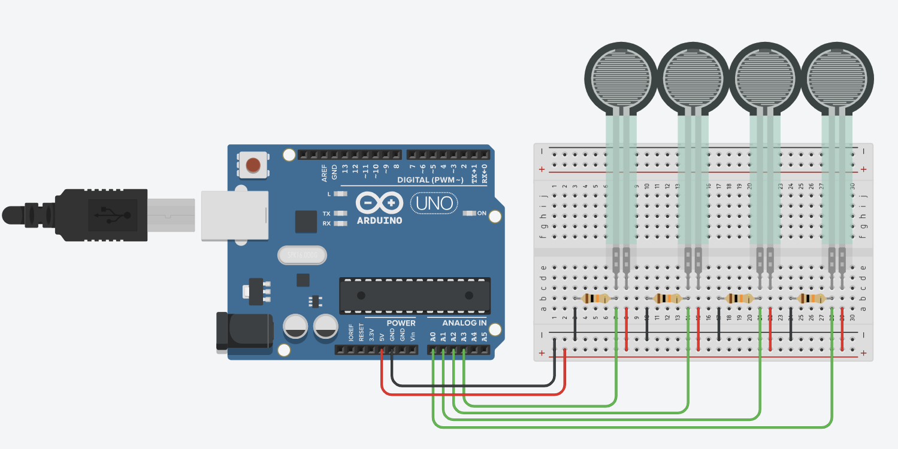
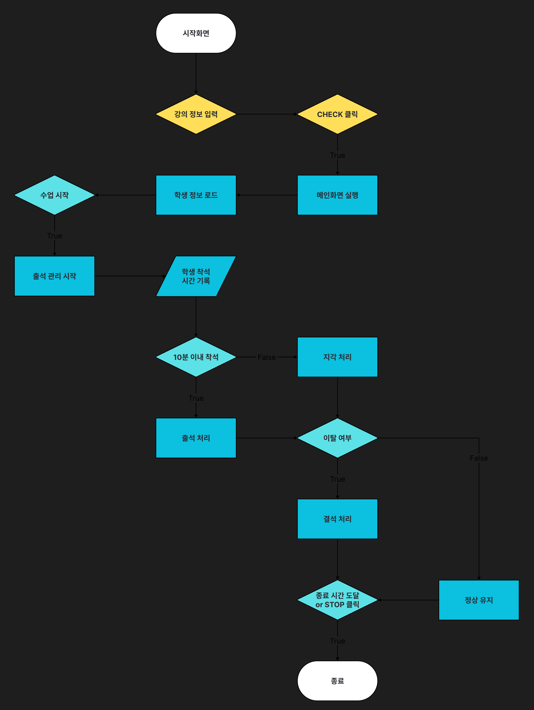
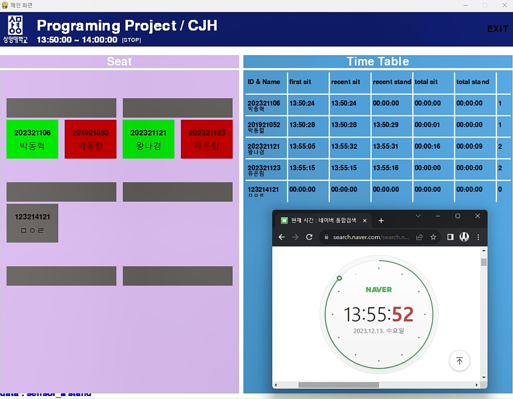

# 📚 출석 관리 시스템 (Attendance Management System)

> **개발 기간**: 2023-11-02 ~ 2023-12-07


<br/>

## 📌 프로젝트 소개

**출석 관리 시스템**은 아두이노 압력 센서와 파이썬(Pygame GUI)을 이용하여 학생들의 출결 상태를 자동으로 관리하는 프로그램입니다.  
강의, 회의 등 다양한 상황에서 출석 여부를 실시간으로 체크하고 효율적으로 관리할 수 있도록 개발되었습니다.

<br/>

## 🎯 주요 기능

- 아두이노 압력 센서를 통해 사용자의 착석 여부 감지
- Pygame 기반의 GUI 인터페이스 제공
- 강의 정보(강의명, 사용자명, 시작/종료 시간) 입력 기능
- 좌석 착석/이탈 시간을 기록하여 출석 여부 판단
- 일정 시간 이상 착석 시 출석 인정

<br/>

## 🛠 사용 기술

- **Python 3.x**
- **Pygame**: GUI 화면 구현
- **Arduino**: 압력 센서를 통한 물리적 상태 감지
- **Serial 통신**: 아두이노와 파이썬 간 데이터 송수신

<br/>

## 🔧 사용 방법
1. 프로그램 실행
2. GUI 화면에 아래 항목 입력:
   - 강의명
   - 사용자 이름
   - 강의 시작 시간
   - 강의 종료 시간
3. `CHECK` 버튼 클릭
4. 학생이 자리에 **앉거나 일어날 때 시간 자동 기록**
5. 사전에 정의된 기준 시간 이상 착석 시 `출석 인정`

<br/>

## 📌 기대 효과
- 출석 체크 자동화로 **시간 및 인력 절약**
- 정확하고 체계적인 출석 관리 가능
- 다양한 장소(강의실, 회의실 등)에서 활용 가능
- 사용자의 편의성 및 효율성 증대

<br/>

## 🛠 시스템 구성도 (Arduino 회로도)

아두이노와 압력 센서를 기반으로 구성된 회로도입니다.



---

## 🔁 프로그램 순서도

출석 체크 흐름을 시각화한 순서도입니다.



---

## 🖥️ GUI 실행 화면

출석을 자동으로 관리할 수 있는 Pygame 기반 GUI 화면입니다.



<br/>

## 📁 디렉토리 구조
```bash
attendance-system/
├── Arduino/   # 아두이노 관련 코드
│ ├── FSRsensor/  # 출석 감지용 센서 코드
│ │ └── FSRsensor.ino
│ └── sen/        # 압력센서 값 측정용 코드
│   └── sen.ino
│
├── pp2/       # 파이썬 GUI 애플리케이션
│ ├── main.py     # 출석 관리 메인 로직
│ ├── start.py    # 시작 화면 (강의 정보 입력)
│ ├── run.py      # 통합 실행 파일
│ ├── data.txt    # 로그 데이터
│ ├── student.txt # 학생 정보 파일
│ └── img/        # GUI에 사용되는 이미지 리소스
│
├── images/    # README.md용 이미지 자료
│ ├── flowchart.png
│ ├── arduino_diagram.png
│ └── gui_screenshot.png
│
└── README.md  # 프로젝트 설명 문서
